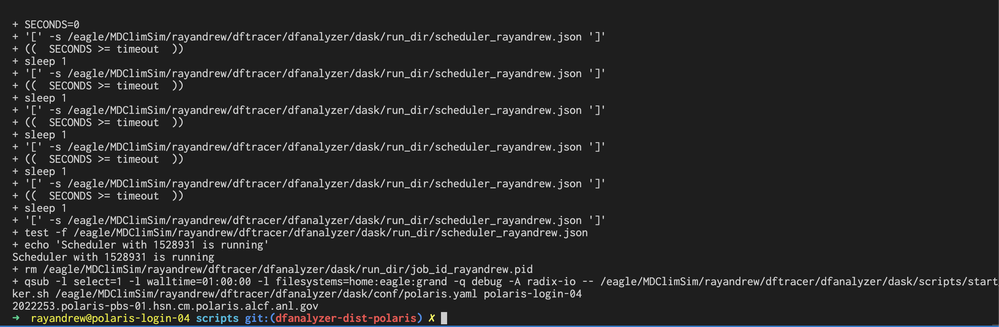
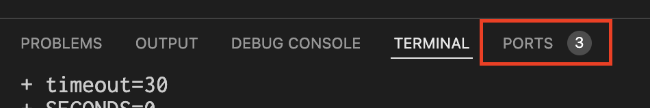
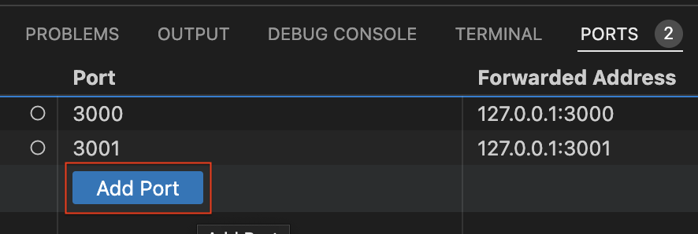
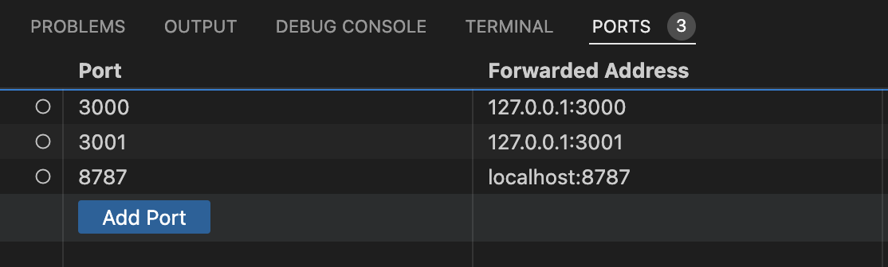
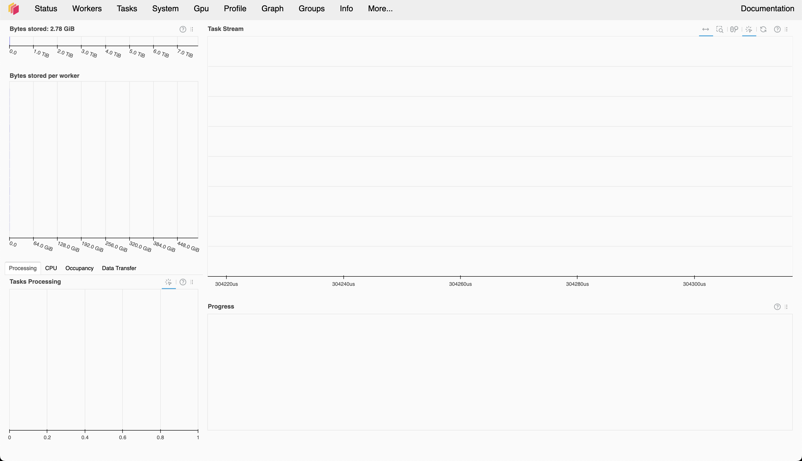

===========================
ALCF Polaris
===========================

This section describes how to run DFAnalyzer on `ALCF Polaris <https://docs.alcf.anl.gov/polaris/getting-started/>`_.

----------

Make sure you already did the necessary steps to build the :code:`dfanalyzer` :doc:`here <dfanalyzer_build>`.

.. warning::

   All the steps below should be run in the Polaris login node!

----------------------------------------
Logging in to Polaris Login Node
----------------------------------------

.. code-block:: bash

   ssh <username>@polaris.alcf.anl.gov # and type password from MobilePass/other auth

.. note::

   We recommend you to use VSCode to connect to the Polaris login node as it supports opening Jupyter Notebook and do port forwarding natively

----------------------------------------
Initializing Dask Configurations
----------------------------------------

.. code-block:: bash

   cd <dftracer>/dfanalyzer/dask/conf
   ./install_dask_env.sh

.. note::
   
   This will create new directory :code:`$HOME/.dftracer/` with files: :code:`$HOME/.dftracer/configuration.sh` and :code:`$HOME/.dftracer/configuration.yaml`

----------------------------------------
Changing :code:`$HOME/.dftracer/configuration.yaml`
----------------------------------------

.. code-block:: bash

   cd $HOME/.dftracer
   <EDITOR> configuration.yaml

By default, :code:`$HOME/.dftracer/configuration.yaml` will contain this entry

.. code-block:: yaml

   app: /usr/WS2/haridev/dftracer
   env: ${DFTRACER_APP}/venv

Please modify the :code:`app` your cloned :code:`<dftracer>` directory and :code:`env` to Python virtual environment that you used to install :code:`dfanalyzer` code :doc:`here <dfanalyzer_build>`.

Specifically, for ALCF Polaris, we should add one more entry to :code:`$HOME/.dftracer/configuration.yaml`

.. code-block:: yaml

   account: <your project allocation account>

.. note::

   This account will be used to reserve compute node for Dask distributed workers

----------------------------------------
Changing :code:`polaris.yaml` config
----------------------------------------

.. code-block:: bash

   cd <dftracer>/dfanalyzer/dask/conf
   <EDITOR> polaris.yaml

.. note::
   
   Please change the :code:`polaris.yaml` configuration accordingly based on your needs. For example, if you need more nodes, you can change :code:`num_nodes` under :code:`job` key or maybe change :code:`wall_time_min`, etc. For more information regarding ALCF Polaris queue, please look here at `Running Jobs on Polaris <https://docs.alcf.anl.gov/polaris/running-jobs/>`_

----------------------------------------
Executing scheduler
----------------------------------------

.. code-block:: bash

   cd <dftracer>/dfanalyzer/dask/scripts
   ./start_dask_distributed.sh

.. note::

   Wait for several seconds because this script will try to reserve the compute nodes for you using PBS Job Scheduler

.. warning::

   If you got error with message "port" is used, you may try changing the port in :code:`<dftracer/dfanalyzer/dask/conf/polaris.yaml` or maybe checking whether other scheduler is running using :code:`ps -ef | grep dask` to get the process id (PID) and kill the process using :code:`kill -9 <pid>`

If it runs successfully, you should message below

.. note::

   Please check the file `<dftracer>/dfanalyzer/dask/logs/worker_<jobid>.log` in case there are some problems when running the workers on compute node

----------------------------------------
Forwarding the Port
----------------------------------------

We recommend you running notebook inside VSCode because it supports port forwarding natively. In the VSCode, navigate to the bottom bar (where the terminal is). Now, click on the :code:`PORTS` tab as you can see in below screenshot

---------
        
Then, click :code:`Add Port` below

to add new port and type :code:`8787` since that port is used as :code:`Dask` monitoring webpage. If you type it correctly, you should show the port is added as new entry

---------

Now, try connecting to `http://localhost:8787 <http://localhost:8787>`_ and, voila, you will see the :code:`Dask` scheduler monitoring!

----------------------------------------
Opening Notebook File
----------------------------------------

In your VSCode, navigate to

.. code-block:: bash

   <dftracer>/examples/dfanalyzer/dfanalyzer-distributed.ipynb

And just run each cells as usual.

.. note::
   
   Please use this as the starting point to analyze your traces. Feel free to copy and adjust it if needed!

----------------------------------------
Stopping Dask Distributed Workers
----------------------------------------

.. code-block:: bash

   cd <dftracer>/dfanalyzer/dask/scripts
   ./stop_dask_distributed.sh

.. note::

   Wait for several seconds because this script will try to kill the workers and deallocate the compute nodes

----------------------------------------
Tips and Tricks
----------------------------------------

#. Add additional scripts to be executed in compute node

   Sometimes we need to execute scripts before executing worker, e.g. setup additional environment variables such as adding :code:`LD_LIBRARY_PATH` or other variables.
   For this purpose, :code:`dftracer` supports this by editing :code:`$HOME/.dftracer/configuration.sh`.

   .. code-block:: bash

      <EDITOR> $HOME/.dftracer/configuration.sh
      #
      # add new line at the end of the file
      # e.g.
      # export LD_LIBRARY_PATH=/opt/cray/libfabric/1.15.2.0/lib64:${LD_LIBRARY_PATH}
      
                   
