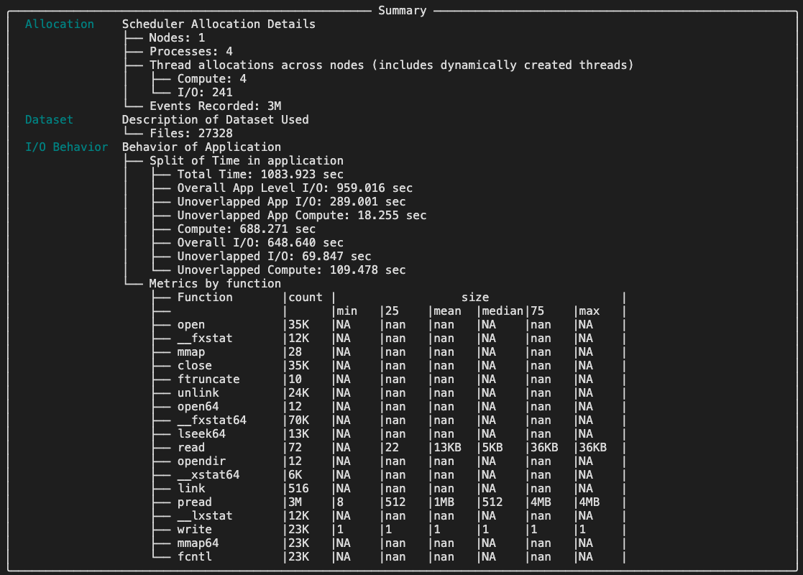

===========================
Overlap Analysis
===========================

This section describes how to run I/O and Computation Analysis on DFAnalyzer.

----------

Make sure you already did the necessary steps to build the :code:`dfanalyzer` :doc:`here <dfanalyzer_build>`.

----------------------------------------
Overlap vs Non-overlap Analysis
----------------------------------------

When we build our model and utilizing our dataloader with multiple dataloader workers
and prefetching, we hope that data loading can be hidden behind the computation.

In this case, we call this as "Best Case" because the I/O and computation are overlapped.

However, in some cases, the I/O and computation are not overlapped due to faster computation time compared to I/O time (e.g. bandwidth in the filesystem is not fully utilized).

For this, we can analyze the overlap between I/O and computation using the :code:`dfanalyzer`.

This page will guide you how to do overlap analysis on top of :code:`dftracer` and :code:`dfanalyzer`.

.. note::

    This tutorial assume you use :code:`Pytorch`, however, this technique can be applied to other frameworks as well.

----------------------------------------
Annotating using DFTracer
----------------------------------------

Assume we have training loop similar to this:

.. code-block:: python

    def forward(model: torch.nn.Module, x: torch.Tensor):
        ... # additional actions here
        output = model(x)
        ...
        return output

    def training(model, optimizer, dataloader, num_epoch):
        for epoch in range(num_epoch):
            for batch in dataloader:
               optimizer.zero_grad()
               out = forward(batch)
               loss = calculate_loss(out)
               loss.backward()
               optimizer.step()

Now, we need to modify code a bit to annotate computation and I/O using :code:`dftracer`

.. code-block:: python

    from dftracer.logger import dft_fn as Profile

    dlp_computation = Profile("computation")
    #                               ^
    # will be map as:              "cat"
    dlp_io = Profile("IO", "real_IO")
    #                  ^       ^
    # will be map as: "cat"  "name"

    @dlp_computation.log # here we annotate as this computation
    def forward(model: torch.nn.Module, x: torch.Tensor):
        ...
        output = model(x)
        ...
        return output

    def training(model, optimizer, dataloader, num_epoch):
        for epoch in range(num_epoch):
            for batch in dlp_io.iter(dataloader): # we annotate this as I/O
               optimizer.zero_grad()
               out = forward(batch)
               loss = calculate_loss(out)
               loss.backward()
               optimizer.step()

    # or maybe even better, annotate the __getitem__ or iterable in your dataset

    # dlp_dataset = Profile("MyDataset")
    # class MyDataset(torch.utils.data.Dataset):
    #     def __len__(self):
    #         return len(self.data)

    #     @dlp_dataset.log
    #     def __getitem__(self, idx: int):
    #         ...

----------------------------------------
Analysis using DFAnalyzer
----------------------------------------

Now, let's open the :code:`dfanalyzer-distributed.ipynb` in the :code:`examples/dfanalyzer` directory.

Let's tweak function :code:`get_conditions_stormer` and change it to :code:`get_conditions_<MY_MODEL>`. Let's assume :code:`<MY_MODEL>` is "cool_ml" in this example.

.. code-block:: python

    def get_conditions_cool_ml(json_object):
        app_io_econd = (
            "IO" in json_object["cat"] # <----- specify "IO" cat as App I/O
        )  # I/O has that application is issuing
        compute_cond = "compute" in json_object["cat"] # <----- specify "cat" cat as Computation
        io_cond = json_object["cat"] in ["POSIX", "STDIO"] # <---- leave this as default because dftracer will give the cat for you
        return app_io_cond, compute_cond, io_cond

Scroll down a bit in the same notebook file, and replace :code:`get_conditions_stormer` with :code:`get_conditions_cool_ml`

.. code-block:: python

    conf = update_dft_configuration(
        dask_scheduler=dask_scheduler,
        verbose=True,
        workers=4,
        time_granularity=80e6,
        log_file=f"./df_{os.getenv('USER')}.log",
        conditions=get_conditions_cool_ml, # <---- replace this
    )

Now, scroll down and modify :code:`analyzer` variable in the same notebook file

.. code-block:: python

   analyzer = DFAnalyzer(f"<LOCATION OF YOUR TRACE FILES>/*.pfw.gz") # <-- it supports globbing!

Now, after that, just execute the whole notebook and notice specifically at the line where we call

.. code-block:: python

   items = analyzer.summary()
   items

If it runs successfully, you should see the summary of the overlap analysis.
Below, is the example:

:alt: Overlap Analysis Summary

Here, we can see the info about **Unoverlapped App I/O** and **Unoverlapped I/O** which tell you how severe (in time unit) your I/O and computation are not overlapped.
