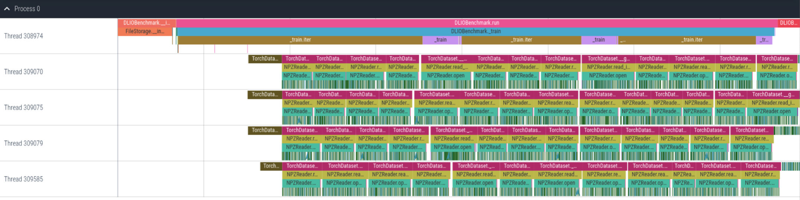

================
Example Programs
================`

------------
C++ Example
------------

Application Level Example:
**************************

.. code-block:: c
   :linenos:

    #include <dftracer/dftracer.h>

    void foo() {
      DFTRACER_CPP_FUNCTION(); // Add at the begining of each function
      sleep(1);
      {
        DFTRACER_CPP_REGION(CUSTOM); // Add at the beginning of code block. keep name unique
        sleep(1);
        DFTRACER_CPP_REGION_START(CUSTOM_BLOCK); // add start. keep name unique
        sleep(1);
        DFTRACER_CPP_REGION_END(CUSTOM_BLOCK); // add end. Match name from START.
      }
    }

    int main(int argc, char *argv[]) {
      // Basic Bookkeeping
      int init = 0;
      if (argc > 2) {
        if (strcmp(argv[2], "1") == 0) {
          // Initialize Application Profiler
          DFTRACER_CPP_INIT(nullptr, nullptr, nullptr);
          init = 1;
        }
      }
      char filename[1024];
      sprintf(filename, "%s/demofile.txt", argv[1]);

      // Run functions
      foo();
      // Implicit I/O calls No need for marking.
      FILE *fh = fopen(filename, "w+");
      if (fh != NULL) {
        fwrite("hello", sizeof("hello"), 1, fh);
        fclose(fh);
      }
      if (init == 1) {
        // Finalize Application Profiler
        DFTRACER_CPP_FINI();
      }
      return 0;
    }

For this example, link with libdftracer.so at compile time.
As the DFTRACER_CPP_INIT do not pass log file or data dir, we need to set ``DFTRACER_LOG_FILE`` and ``DFTRACER_DATA_DIR``.
By default the DFTracer mode is set to FUNCTION.
Example of running this configurations are:

.. code-block:: bash
   :linenos:

    # the process id, app_name and .pfw will be appended by the profiler for each app and process.
    # name of final log file is ~/log_file-<APP_NAME>-<PID>.pfw
    DFTRACER_LOG_FILE=~/log_file
    # Colon separated paths for including for profiler
    DFTRACER_DATA_DIR=/dev/shm/:/p/gpfs1/$USER/dataset
    # Enable profiler
    DFTRACER_ENABLE=1

LD_PRELOAD Example:
**************************

.. code-block:: c
   :linenos:

    #include <dftracer/dftracer.h>

    int main(int argc, char *argv[]) {
      char filename[1024];
      sprintf(filename, "%s/demofile.txt", argv[1]);
      foo(); # function will be ignored in pure LD_PRELOAD mode.
      // Implicit I/O calls No need for marking.
      FILE *fh = fopen(filename, "w+");
      if (fh != NULL) {
        fwrite("hello", sizeof("hello"), 1, fh);
        fclose(fh);
      }
      return 0;
    }

For this example, LD_PRELOAD the executable with libdftracer_preload.so at runtime.
We need to set ``DFTRACER_LOG_FILE`` and ``DFTRACER_DATA_DIR``.
Example of running this configurations are:

.. code-block:: bash
   :linenos:

    # the process id, app_name and .pfw will be appended by the profiler for each app and process.
    # name of final log file is ~/log_file-<APP_NAME>-<PID>.pfw
    export DFTRACER_LOG_FILE=~/log_file
    # Colon separated paths for including for profiler
    export DFTRACER_DATA_DIR=/dev/shm/:/p/gpfs1/$USER/dataset
    # Set the mode to PRELOAD
    export DFTRACER_INIT=PRELOAD
    # Enable profiler
    export DFTRACER_ENABLE=1

Hybrid Example:
**************************

.. code-block:: c
   :linenos:

    #include <dftracer/dftracer.h>

    void foo() {
      DFTRACER_CPP_FUNCTION(); // Add at the begining of each function
      sleep(1);
      {
        DFTRACER_CPP_REGION(CUSTOM); // Add at the beginning of code block. keep name unique
        sleep(1);
        DFTRACER_CPP_REGION_START(CUSTOM_BLOCK); // add start. keep name unique
        sleep(1);
        DFTRACER_CPP_REGION_END(CUSTOM_BLOCK); // add end. Match name from START.
      }
    }

    int main(int argc, char *argv[]) {
      // Basic Bookkeeping
      int init = 0;
      if (argc > 2) {
        if (strcmp(argv[2], "1") == 0) {
          // Initialize Application Profiler
          DFTRACER_CPP_INIT(nullptr, nullptr, nullptr);
          init = 1;
        }
      }
      char filename[1024];
      sprintf(filename, "%s/demofile.txt", argv[1]);

      // Run functions
      foo();
      // Implicit I/O calls No need for marking.
      FILE *fh = fopen(filename, "w+");
      if (fh != NULL) {
        fwrite("hello", sizeof("hello"), 1, fh);
        fclose(fh);
      }
      if (init == 1) {
        // Finalize Application Profiler
        DFTRACER_CPP_FINI();
      }
      return 0;
    }

For this example, link with libdftracer.so at compile time and LD_PRELOAD the executable with libdftracer_preload.soat runtime.
As the DFTRACER_CPP_INIT do not pass log file or data dir, we need to set ``DFTRACER_LOG_FILE`` and ``DFTRACER_DATA_DIR``.
By default the DFTracer mode is set to FUNCTION.
Example of running this configurations are:

.. code-block:: bash
   :linenos:

    # the process id, app_name and .pfw will be appended by the profiler for each app and process.
    # name of final log file is ~/log_file-<APP_NAME>-<PID>.pfw
    DFTRACER_LOG_FILE=~/log_file
    # Colon separated paths for including for profiler
    DFTRACER_DATA_DIR=/dev/shm/:/p/gpfs1/$USER/dataset
    # Set the mode to PRELOAD
    export DFTRACER_INIT=PRELOAD
    # Enable profiler
    DFTRACER_ENABLE=1

------------
C Example
------------

Application Level Example:
**************************

.. code-block:: c
   :linenos:

    #include <dftracer/dftracer.h>

    void foo() {
      DFTRACER_C_FUNCTION_START();
      sleep(1);
      if (<CONDITION>) {
        DFTRACER_C_FUNCTION_END();
        return; // Define DFTRACER_C_FUNCTION_END on every branch
      }
      {
        DFTRACER_C_REGION_START(CUSTOM);
        sleep(1);
        DFTRACER_C_REGION_END(CUSTOM); // END region CUSTOM.
      }
      DFTRACER_C_FUNCTION_END(); // Define DFTRACER_C_FUNCTION_END on every branch
    }

    int main(int argc, char *argv[]) {
      // Basic Bookkeeping
      int init = 0;
      if (argc > 2) {
        if (strcmp(argv[2], "1") == 0) {
          // Initialize Application Profiler
          DFTRACER_C_INIT(nullptr, nullptr, nullptr);
          init = 1;
        }
      }
      char filename[1024];
      sprintf(filename, "%s/demofile.txt", argv[1]);

      // Run functions
      foo();
      // Implicit I/O calls No need for marking.
      FILE *fh = fopen(filename, "w+");
      if (fh != NULL) {
        fwrite("hello", sizeof("hello"), 1, fh);
        fclose(fh);
      }
      if (init == 1) {
        // Finalize Application Profiler
        DFTRACER_C_FINI();
      }
      return 0;
    }

For this example, link with libdftracer.so at compile time.
As the DFTRACER_CPP_INIT do not pass log file or data dir, we need to set ``DFTRACER_LOG_FILE`` and ``DFTRACER_DATA_DIR``.
By default the DFTracer mode is set to FUNCTION.
Example of running this configurations are:

.. code-block:: bash
   :linenos:

    # the process id, app_name and .pfw will be appended by the profiler for each app and process.
    # name of final log file is ~/log_file-<APP_NAME>-<PID>.pfw
    DFTRACER_LOG_FILE=~/log_file
    # Colon separated paths for including for profiler
    DFTRACER_DATA_DIR=/dev/shm/:/p/gpfs1/$USER/dataset
    # Enable profiler
    DFTRACER_ENABLE=1

LD_PRELOAD Example:
**************************

.. code-block:: c
   :linenos:

    #include <dftracer/dftracer.h>

    int main(int argc, char *argv[]) {
      char filename[1024];
      sprintf(filename, "%s/demofile.txt", argv[1]);
      foo(); # function will be ignored in pure LD_PRELOAD mode.
      // Implicit I/O calls No need for marking.
      FILE *fh = fopen(filename, "w+");
      if (fh != NULL) {
        fwrite("hello", sizeof("hello"), 1, fh);
        fclose(fh);
      }
      return 0;
    }

For this example, LD_PRELOAD the executable with libdftracer_preload.so at runtime.
We need to set ``DFTRACER_LOG_FILE`` and ``DFTRACER_DATA_DIR``.
Example of running this configurations are:

.. code-block:: bash
   :linenos:

    # the process id, app_name and .pfw will be appended by the profiler for each app and process.
    # name of final log file is ~/log_file-<APP_NAME>-<PID>.pfw
    export DFTRACER_LOG_FILE=~/log_file
    # Colon separated paths for including for profiler
    export DFTRACER_DATA_DIR=/dev/shm/:/p/gpfs1/$USER/dataset
    # Set the mode to PRELOAD
    export DFTRACER_INIT=PRELOAD
    # Enable profiler
    export DFTRACER_ENABLE=1

Hybrid Example:
**************************

.. code-block:: c
   :linenos:

    #include <dftracer/dftracer.h>

    void foo() {
      DFTRACER_C_FUNCTION_START();
      sleep(1);
      if (<CONDITION>) {
        DFTRACER_C_FUNCTION_END();
        return; // Define DFTRACER_C_FUNCTION_END on every branch
      }
      {
        DFTRACER_C_REGION_START(CUSTOM);
        sleep(1);
        DFTRACER_C_REGION_END(CUSTOM); // END region CUSTOM.
      }
      DFTRACER_C_FUNCTION_END(); // Define DFTRACER_C_FUNCTION_END on every branch
    }

    int main(int argc, char *argv[]) {
      // Basic Bookkeeping
      int init = 0;
      if (argc > 2) {
        if (strcmp(argv[2], "1") == 0) {
          // Initialize Application Profiler
          DFTRACER_C_INIT(nullptr, nullptr, nullptr);
          init = 1;
        }
      }
      char filename[1024];
      sprintf(filename, "%s/demofile.txt", argv[1]);

      // Run functions
      foo();
      // Implicit I/O calls No need for marking.
      FILE *fh = fopen(filename, "w+");
      if (fh != NULL) {
        fwrite("hello", sizeof("hello"), 1, fh);
        fclose(fh);
      }
      if (init == 1) {
        // Finalize Application Profiler
        DFTRACER_C_FINI();
      }
      return 0;
    }

For this example, link with libdftracer.so at compile time and LD_PRELOAD the executable with libdftracer_preload.so at runtime.
As the DFTRACER_CPP_INIT do not pass log file or data dir, we need to set ``DFTRACER_LOG_FILE`` and ``DFTRACER_DATA_DIR``.
By default the DFTracer mode is set to FUNCTION.
Example of running this configurations are:

.. code-block:: bash
   :linenos:

    # the process id, app_name and .pfw will be appended by the profiler for each app and process.
    # name of final log file is ~/log_file-<APP_NAME>-<PID>.pfw
    DFTRACER_LOG_FILE=~/log_file
    # Colon separated paths for including for profiler
    DFTRACER_DATA_DIR=/dev/shm/:/p/gpfs1/$USER/dataset
    # Set the mode to PRELOAD
    export DFTRACER_INIT=PRELOAD
    # Enable profiler
    DFTRACER_ENABLE=1

----------------
Python Example
----------------

Application Level Example:
**************************

.. code-block:: python
   :linenos:

    from dftracer.logger import dftracer, dft_fn
    log_inst = dftracer.initialize_log(logfile=None, data_dir=None, process_id=-1)
    dft_fn = dft_fn("COMPUTE")

    # Example of using function decorators
    @dft_fn.log
    def log_events(index):
        sleep(1)

    # Example of function spawning and implicit I/O calls
    def posix_calls(val):
        index, is_spawn = val
        path = f"{cwd}/data/demofile{index}.txt"
        f = open(path, "w+")
        f.write("Now the file has more content!")
        f.close()
        if is_spawn:
            print(f"Calling spawn on {index} with pid {os.getpid()}")
            log_inst.finalize() # This need to be called to correctly finalize DFTracer.
        else:
            print(f"Not calling spawn on {index} with pid {os.getpid()}")

    # NPZ calls internally calls POSIX calls.
    def npz_calls(index):
        # print(f"{cwd}/data/demofile2.npz")
        path = f"{cwd}/data/demofile{index}.npz"
        if os.path.exists(path):
            os.remove(path)
        records = np.random.randint(255, size=(8, 8, 1024), dtype=np.uint8)
        record_labels = [0] * 1024
        np.savez(path, x=records, y=record_labels)

    def main():
        log_events(0)
        npz_calls(1)
        with get_context('spawn').Pool(1, initializer=init) as pool:
            pool.map(posix_calls, ((2, True),))
        log_inst.finalize()

    if __name__ == "__main__":
        main()

For this example, as the DFTRACER_CPP_INIT do not pass log file or data dir, we need to set ``DFTRACER_LOG_FILE`` and ``DFTRACER_DATA_DIR``.
By default the DFTracer mode is set to FUNCTION.
Example of running this configurations are:

.. code-block:: bash
   :linenos:

    # the process id, app_name and .pfw will be appended by the profiler for each app and process.
    # name of final log file is ~/log_file-<APP_NAME>-<PID>.pfw
    DFTRACER_LOG_FILE=~/log_file
    # Colon separated paths for including for profiler
    DFTRACER_DATA_DIR=/dev/shm/:/p/gpfs1/$USER/dataset:$PWD/data
    # Enable profiler
    DFTRACER_ENABLE=1

LD_PRELOAD Example:
*******************

.. code-block:: python
   :linenos:

    # Example of function spawning and implicit I/O calls
    def posix_calls(val):
        index, is_spawn = val
        path = f"{cwd}/data/demofile{index}.txt"
        f = open(path, "w+")
        f.write("Now the file has more content!")
        f.close()
        if is_spawn:
            print(f"Calling spawn on {index} with pid {os.getpid()}")
        else:
            print(f"Not calling spawn on {index} with pid {os.getpid()}")

    # NPZ calls internally calls POSIX calls.
    def npz_calls(index):
        # print(f"{cwd}/data/demofile2.npz")
        path = f"{cwd}/data/demofile{index}.npz"
        if os.path.exists(path):
            os.remove(path)
        records = np.random.randint(255, size=(8, 8, 1024), dtype=np.uint8)
        record_labels = [0] * 1024
        np.savez(path, x=records, y=record_labels)

    def main():
        npz_calls(1)
        with get_context('spawn').Pool(1, initializer=init) as pool:
            pool.map(posix_calls, ((2, True),))

    if __name__ == "__main__":
        main()

For this example, LD_PRELOAD the executable with libdftracer_preload.so at runtime.
We need to set ``DFTRACER_LOG_FILE`` and ``DFTRACER_DATA_DIR``.
Example of running this configurations are:

.. code-block:: bash
   :linenos:

    # the process id, app_name and .pfw will be appended by the profiler for each app and process.
    # name of final log file is ~/log_file-<APP_NAME>-<PID>.pfw
    export DFTRACER_LOG_FILE=~/log_file
    # Colon separated paths for including for profiler
    export DFTRACER_DATA_DIR=/dev/shm/:/p/gpfs1/$USER/dataset
    # Set the mode to PRELOAD
    export DFTRACER_INIT=PRELOAD
    # Enable profiler
    export DFTRACER_ENABLE=1

.. _python-hybrid-mode:

Hybrid Example:
**************************

.. code-block:: python
   :linenos:

    from dftracer.logger import dftracer, dft_fn
    log_inst = dftracer.initialize_log(logfile=None, data_dir=None, process_id=-1)
    dft_fn = dft_fn("COMPUTE")

    # Example of using function decorators
    @dft_fn.log
    def log_events(index):
        sleep(1)

    # Example of function spawning and implicit I/O calls
    def posix_calls(val):
        index, is_spawn = val
        path = f"{cwd}/data/demofile{index}.txt"
        f = open(path, "w+")
        f.write("Now the file has more content!")
        f.close()
        if is_spawn:
            print(f"Calling spawn on {index} with pid {os.getpid()}")
            log_inst.finalize() # This need to be called to correctly finalize DFTracer.
        else:
            print(f"Not calling spawn on {index} with pid {os.getpid()}")

    # NPZ calls internally calls POSIX calls.
    def npz_calls(index):
        # print(f"{cwd}/data/demofile2.npz")
        path = f"{cwd}/data/demofile{index}.npz"
        if os.path.exists(path):
            os.remove(path)
        records = np.random.randint(255, size=(8, 8, 1024), dtype=np.uint8)
        record_labels = [0] * 1024
        np.savez(path, x=records, y=record_labels)

    def main():
        log_events(0)
        npz_calls(1)
        with get_context('spawn').Pool(1, initializer=init) as pool:
            pool.map(posix_calls, ((2, True),))
        log_inst.finalize()

    if __name__ == "__main__":
        main()

For this example, use LD_PRELOAD the executable with libdftracer_preload.soat runtime.
As the DFTRACER_CPP_INIT do not pass log file or data dir, we need to set ``DFTRACER_LOG_FILE`` and ``DFTRACER_DATA_DIR``.
By default the DFTracer mode is set to FUNCTION.
Example of running this configurations are:

.. code-block:: bash
   :linenos:

    # the process id, app_name and .pfw will be appended by the profiler for each app and process.
    # name of final log file is ~/log_file-<APP_NAME>-<PID>.pfw
    DFTRACER_LOG_FILE=~/log_file
    # Colon separated paths for including for profiler
    DFTRACER_DATA_DIR=/dev/shm/:/p/gpfs1/$USER/dataset
    # Set the mode to PRELOAD
    export DFTRACER_INIT=PRELOAD
    # Enable profiler
    DFTRACER_ENABLE=1

----------------------------------------------------------------
Resnet50 with pytorch and torchvision example from ALCF Polaris:
----------------------------------------------------------------

Create a separate conda environment for the application and install dftracer

.. code-block:: bash
   :linenos:
  
     #!/bin/bash +x
     set -e
     set -x
     export MODULEPATH=/soft/modulefiles/conda/:$MODULEPATH
     module load 2023-10-04  # This is the latest conda module on Polaris
   
     export ML_ENV=$PWD/PolarisAT/conda-envs/ml_workload_latest_conda_2 # Please change the following path accordingly 
   
     if [[ -e $ML_ENV ]]; then
         conda activate $ML_ENV
     else
         conda create  -p $ML_ENV --clone  /soft/datascience/conda/2023-10-04/mconda3/
         conda activate $ML_ENV
         yes | MPICC="cc -shared -target-accel=nvidia80" pip install --force-reinstall --no-cache-dir --no-binary=mpi4py mpi4py
         yes | pip install --no-cache-dir git+https://github.com/hariharan-devarajan/dftracer.git
         pip uninstall -y torch horovod 
         yes | pip install --no-cache-dir horovod
         #INSTALL OTHER MISSING FILES    
     fi

Since, torchvision.datasets.ImageFolder spawns separate python processes to help the parallel data loading in torch, we will be using the `HYBRID MODE` of the DFTracer (e.g., see 
:ref:`Python Hybrid mode <python-hybrid-mode>`), so that the application can use both APP and PRELOAD Mode to log I/O from all dynamically spawned processes and function profiling from application. 

The following dftracer code is added to profile the application at the function level.
Note: dftracer python level log file location is provided inside the python code in the dftracer.initialize_log() function and the POSIX or STDIO calls level log file location is provided in the job scirpt environment variable `DFTRACER_LOG_FILE`

.. code-block:: python
   :linenos:

     ...
     # From the preamble
     from dftracer.logger import dftracer as logger, dft_fn as dft_event_logging
     dft_pid=os.getpid()
     log_inst=logger.initialize_log(f"./resnet50/dft_fn_py_level-{dft_pid}.pfw", "", dft_pid)
     compute_dft = dft_event_logging("Compute")
     io_dft = dft_event_logging("IO", name="real_IO")
     ...
     # From the train() function
     for i, (images, target) in io_dft.iter(enumerate(train_loader)):
           with dft_event_logging("communication-except-io", name="cpu-gpu-transfer", step=i, epoch=epoch) as transfer:
               images = images.to(device)
               target = target.to(device)
           with dft_event_logging("compute", name="model-compute-forward-prop", step=i, epoch=epoch) as compute:
               output = model(images)
               loss = criterion(output, target)
           with dft_event_logging("compute", name="model-compute-backward-prop", step=i, epoch=epoch) as compute:
               acc1, acc5 = accuracy(output, target, topk=(1, 5))
               losses.update(loss.item(), images.size(0))
               top1.update(acc1[0], images.size(0))
               top5.update(acc5[0], images.size(0))

     ...
     # At the end of main function
     log_inst.finalize()

Job submition script 

.. code-block:: bash
   :linenos:
  
     export MODULEPATH=/soft/modulefiles/conda/:$MODULEPATH
     module load 2023-10-04
     conda activate./dlio_ml_workloads/PolarisAT/conda-envs/ml_workload_latest_conda
   
     export LD_LIBRARY_PATH=$env_path/lib/:$LD_LIBRARY_PATH
     export DFTRACER_LOG_LEVEL=ERROR
     export DFTRACER_ENABLE=1
     export DFTRACER_INC_METADATA=1
     export DFTRACER_INIT=PRELOAD
     export DFTRACER_DATA_DIR=./resnet_original_data #Path to the orignal resnet 50 dataset 
     export DFTRACER_LOG_FILE=./dft_fn_posix_level.pfw
   
     LD_PRELOAD=./dlio_ml_workloads/PolarisAT/conda-envs/ml_workload_latest_conda/lib/python*/site-packages/dftracer/lib/libdftracer_preload.so aprun -n 4 -N 4 python resnet_hvd_dlio.py --batch-size 64 --epochs 1 > dft_fn 2>&1
   
     cat *.pfw > combined_logs.pfw # To combine to a single pfw file. 

-----------------------
Integrated Applications
-----------------------

Here is the list applications that currently use DFTracer.

1. `DLIO Benchmark <https://github.com/argonne-lcf/dlio_benchmark>`_
2. MuMMI
3. Resnet50 with pytorch and torchvision

----------------------------
Example Chrome Tracing Plots
----------------------------

Example of Unet3D application with DLIO Benchmark. This trace shows the first few steps of the benchmark.
Here, we can see that we can get application level calls (e.g., ``train`` and ``TorchDataset``) as well as low-level I/O calls (dark green color).

  
 
