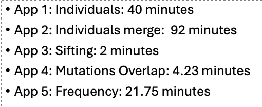

===================================
Pegasus 1000-Genome with DFTracer
===================================

Instructions for tracing Pegasus 1000 Genome with DFTracer on LC Corona. These instructions can be used for any Workflow but you'll need to change the version of the tar files depending on the architecture of your machine and the workflow you are interested in. 
For more information, visit the `workflows repository <https://github.com/OlgaKogiou/workflows>`_.

To follow this tutorial you will need the following requirements:
- Installed Condor.
- Installed Pegasus Workflow Manager.
- Python Virtual Environment with DFTracer installed.

Please refer to :doc:`pegasus_montage` for completing these requirements. 

Step 1: Activate Environment
----------------------------

Source the Python Virtual Environmnet that has DFTracer.

1.1 Create and activate Virtual Environment:

.. code-block:: bash

    python3 -m venv /path/to/pegasus-env
    source /path/to/pegasus-env/bin/activate

1.2 Get the dependencies:

.. code-block:: bash

    pip install git+https://github.com/hariharan-devarajan/dftracer.git

Step 2: Get the 1000genome-workflow
-----------------------------------

Get the code:

.. code-block:: bash

    git clone https://github.com/pegasus-isi/1000genome-workflow.git

Step 3: Prepare software for Pegasus-1000Genome
------------------------------------

3.1 Save to PATH:

.. code-block:: bash

    export PATH=/path/to/pegasus/install/bin:$PATH
    export PATH=/path/to/pegasus/install/sbin:$PATH
    export LD_LIBRARY_PATH=/path/to/pegasus/install//lib:$LD_LIBRARY_PATH
    source ~/.bashrc

3.2 Run Condor:

.. code-block:: bash

    chmod 777 /path/to/pegasus/install/condor.sh
    . /path/to/pegasus/install/condor.sh
    condor_master
    condor_status  # it should show the activity
    condor_q  # it should show the jobs running

.. note:: 
    
    If errors occur, echo the `LD_LIBRARY_PATH` and the `PATH` and make sure :code:`/pegasus/install` is there.

To check if condor_shedd and all other condor processes are running:

.. code-block:: bash

    ps aux | grep condor

If Condor throws errors while trying to connect to another node:

1. Exit the flux allocation:

.. code-block:: bash

    exit

2. Check your processes:

.. code-block:: bash

    ps -u ${USER}

3. Kill all your processes (or those related to Condor if any):

.. code-block:: bash

    killall -u ${USER}

4. Repeat steps 6.3, 6.4, 5.2, 6.5

5. If the problem persists:

.. code-block:: bash

    condor_restart

3.3 Test Pegasus:

.. code-block:: bash

    pegasus-version  # should show 5.0.7

.. note::

If error "Cannot find file with permissions" occurs, touch that file and make sure it has those permissions.

3.4 Configure the Condor/SLURM interface:

.. code-block:: bash

    pegasus-configure-glite

.. note::
    
    If error "Cannot find file with permissions" occurs, touch that file and make sure it has those permissions.

3.5 Configure the DFTracer flags:

.. code-block:: bash
    
    export DFTRACER_INSTALLED=/path/to/pegasus-env/lib/python3.9/site-packages/dftracer/
    export LD_LIBRARY_PATH=$DFTRACER_INSTALLED/lib:$DFTRACER_INSTALLED/lib64:$LD_LIBRARY_PATH
    export DFTRACER_LOG_FILE=/path/to/traces/trace
    # export DFTRACER_DATA_DIR=all (optional)
    export DFTRACER_ENABLE=1
    export DFTRACER_INC_METADATA=1
    # export DFTRACER_INIT=PRELOAD (optional)
    export DFTRACER_BIND_SIGNALS=0
    # export DFTRACER_LOG_LEVEL=ERROR (optional)
    export DFTRACER_TRACE_COMPRESSION=1 
    # dftracer=$DFTRACER_INSTALLED/lib64/libdftracer_preload.so (optional)

You would only need to use the preload version of DFTracer if you have not annotated the application code you are running.
For more information on the flags and their functionalities please turn to :docs:`examples`.

Step 4: Annotate 1000-Genome
---------------------------

4.1 Configure the DFTracer flags:

.. code-block:: bash
    
    export DFTRACER_INSTALLED=/path/to/pegasus-env/lib/python3.9/site-packages/dftracer/
    export LD_LIBRARY_PATH=$DFTRACER_INSTALLED/lib:$DFTRACER_INSTALLED/lib64:$LD_LIBRARY_PATH
    export DFTRACER_LOG_FILE=/path/to/traces/trace
    # export DFTRACER_DATA_DIR=all (optional)
    export DFTRACER_ENABLE=1
    export DFTRACER_INC_METADATA=1
    # export DFTRACER_INIT=PRELOAD (optional)
    export DFTRACER_BIND_SIGNALS=0
    # export DFTRACER_LOG_LEVEL=ERROR (optional)
    export DFTRACER_TRACE_COMPRESSION=1 
    # dftracer=$DFTRACER_INSTALLED/lib64/libdftracer_preload.so (optional)

4.2 Navigate to the :code:`/path/to/1000genome-workflow` directory. The source code that is useful to annotate and "time" for Monatge is in the `/bin` folder. As an example we use the `frequency.py` application which is located in :code:`/path/to/1000genome-workflow/bin` folder. We annotate the code as follows:

.. code-block:: python

    from dftracer.logger import dftracer, dft_fn
    log_inst = dftracer.initialize_log(logfile=None, data_dir=None, process_id=-1)

    CAT = "PY_APP"

    df_log = dft_fn(CAT)

    ...

    class ...
    ...
    if __name__ == '__main__':
        with dft_fn(name=f"frequency", cat=CAT):
        (code...)
        log_inst.finalize()

The idea is to annotate the application so that we capture all the calls that occur during the running of the main fuction. These application calls will appear on the traces as events with "CAT:PY_APP" and their name will be "frequency". We can annotate further, by creating regions. For more details please refer to :doc:`examples.rst`. 

4.3 After the annotation with DFTracer, we can run the workflow with pegasus after first creating the data, planning the workflow and executing with `pegasus-run`:

.. code-block:: bash

    ./prepare_input.sh
    ./daxgen.py
    ./daxgen.py -D 20130502 -f data.csv -i 1

For more information please visit `https://github.com/pegasus-isi/1000genome-workflow/tree/master`.

4.4 After the workflow finishes we navigate into :code:`/path/to/traces/` that we set earlier with the DFTracer flags. We then load those traces on DFAnalyzer. The application calls will also have "CAT: PY_APP" as this is a Python code workflow. Here is the result of tracing 1000 Genome on LC Corona with 32 nodes and 48 processes per node using DFTracer and analyzing the tracing using DFAnalyzer:

