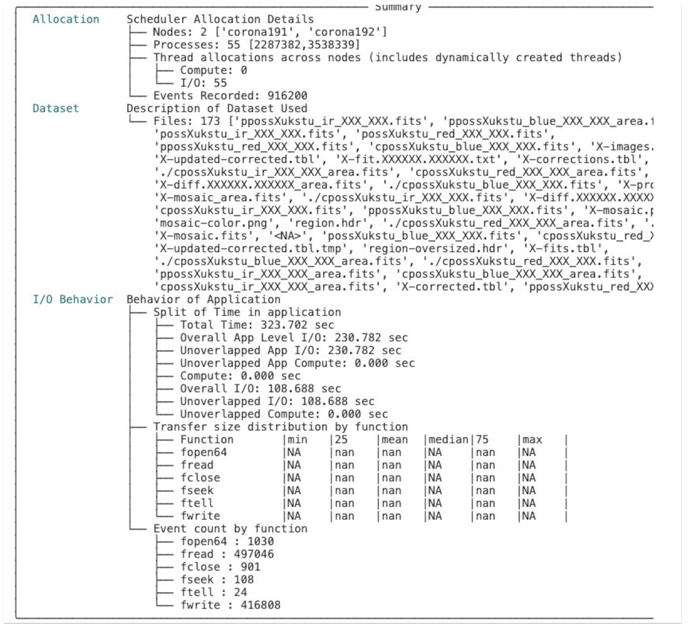
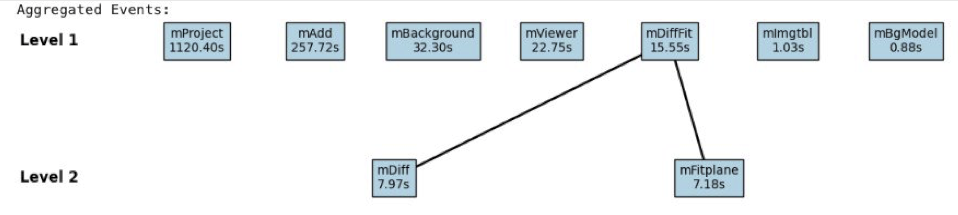
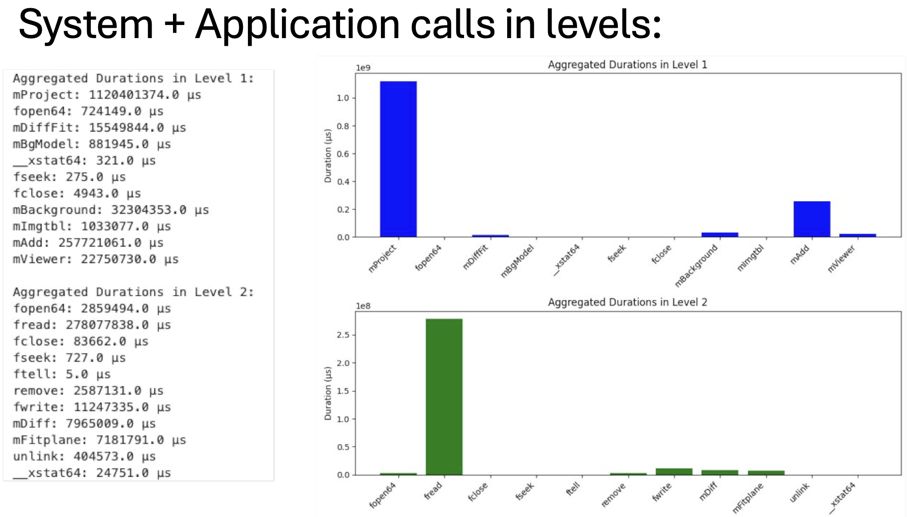

===================================
Pegasus Montage with DFTracer
===================================

Instructions for tracing Pegasus Montage with DFTracer on LC Corona. These instructions can be used for any Workflow but you'll need to change the version of the tar files depending on the architecture of your machine and the workflow you are interested in. 
For more information, visit the `workflows repository <https://github.com/OlgaKogiou/workflows>`_.

Step 1: Install Condor
----------------------

1.1 Get the zip:

.. code-block:: bash

    wget https://research.cs.wisc.edu/htcondor/tarball/10.x/current/condor-x86_64_CentOS8-stripped.tar.gz

1.2 Untar to your condor folder:

.. code-block:: bash

    tar -x -f condor*.tar.gz
    mkdir condor
    cd condor-*stripped
    mv * ../condor
    cd ..
    rm -rf condor-*stripped
    rm condor-stripped.tar.gz

1.3 Configure:

.. code-block:: bash

    cd condor
    ./bin/make-personal-from-tarball

Step 2: Install Pegasus
-----------------------

2.1 Get the zip from Tarballs:

.. code-block:: bash

    wget https://download.pegasus.isi.edu/pegasus/5.0.7/pegasus-binary-5.0.7-x86_64_rhel_7.tar.gz
    wget https://download.pegasus.isi.edu/pegasus/5.0.7/pegasus-worker-5.0.7-x86_64_rhel_7.tar.gz

2.2 Untar to your Pegasus folder (both for pegasus and pegasus-worker):

.. code-block:: bash

    tar zxf pegasus-*.tar.gz
    rm pegasus-*.tar.gz

Step 3: Install and compile Montage
-----------------------------------

3.1 Get the code:

.. code-block:: bash

    git clone https://github.com/Caltech-IPAC/Montage.git

3.2 Compile:

.. code-block:: bash

    cd Montage
    make

.. note:: 
    
    Make sure there are no errors. By cloning the GitHub repo, you get the most recent version, likely with no compiler errors. :code:`cd Montage/bin` and make sure it is not empty.

3.3 Save in Paths:

.. code-block:: bash

    export PATH=/path/to/Montage/bin:$PATH

Step 4: Get the montage-pegasus-v3
----------------------------------

4.1 Create and activate Virtual Environment:

.. code-block:: bash

    python3 -m venv /path/to/pegasus-env
    source /path/to/pegasus-env/bin/activate

4.2 Install dependencies:

.. code-block:: bash

    pip install astropy
    pip install pegasus-wms
    pip install git+https://github.com/hariharan-devarajan/dftracer.git

4.3 Get the code:

.. code-block:: bash

    git clone https://github.com/pegasus-isi/montage-workflow-v3.git

Step 5: Compile the pegasus-mpi-cluster from source
---------------------------------------------------

5.1 Get the code:

.. code-block:: bash

    git clone https://github.com/pegasus-isi/pegasus.git

5.2 Make sure you’re in the virtual environment for Pegasus:

.. code-block:: bash

    source /path/to/pegasus-env/bin/activate

5.3 Make sure you have the prerequisites:

1. Git 
2. Java 8 or higher
3. Python 3.5 or higher
4. R
5. Ant
6. gcc
7. g++
8. make
9. tox 3.14.5 or higher
10. mysql (optional, required to access MySQL databases)
11. postgresql (optional, required to access PostgreSQL databases)
12. Python pyyaml
13. Python GitPython

5.4 Compile:

.. code-block:: bash

    cd pegasus
    ant compile-pegasus-mpi-cluster

5.5 Copy it to your Pegasus folder:

.. code-block:: bash

    cd packages/pegasus-mpi-cluster/
    cp pegasus-mpi-cluster/ /path/to/pegasus-5.0.7/bin

.. note:: 

    If errors occur while compiling, make sure that `MVAPICH` is loaded:

.. code-block:: bash

    module load mvapich2-tce/2.3.7
    echo $LD_LIBRARY_PATH

Step 6: Create a single “install” directory for all Pegasus software
--------------------------------------------------------------------

This will help in resolving errors like “cannot find .. in your path”.

6.1 Move into the Pegasus directory (the one you compiled from source) and make a directory called install:

.. code-block:: bash

    cd pegasus
    mkdir install

6.2 Copy all components from pegasus-5.0.7 and condor into the :code:`pegasus/install` folder:

.. code-block:: bash

    cd ../condor
    cp * ../pegasus/install
    cp -r * ../pegasus/install
    cd ../pegasus-5.0.7
    cp * ../pegasus/install
    cp -r * ../pegasus/install

.. note:: 

    If you encounter errors about overwriting :code:`/bin` or :code:`/lib` folders, you have to do it manually by cd into those folders and copying everything to :code:`/pegasus/install/bin` or :code:`/pegasus/install/lib`. Make sure all components are there, otherwise Pegasus and Condor cannot run.

Step 7: Prepare software for Pegasus-Montage
----------------------------------

7.1 Make sure you are in the virtual environment still. If not, source it again by repeating 5.2.

7.2 Save to PATH:

.. code-block:: bash

    export PATH=/path/to/pegasus/install/bin:$PATH
    export PATH=/path/to/pegasus/install/sbin:$PATH
    export LD_LIBRARY_PATH=/path/to/pegasus/install//lib:$LD_LIBRARY_PATH
    source ~/.bashrc

7.3 Run Condor:

.. code-block:: bash

    chmod 777 /path/to/pegasus/install/condor.sh
    . /path/to/pegasus/install/condor.sh
    condor_master
    condor_status  # it should show the activity
    condor_q  # it should show the jobs running

.. note:: 
    
    If errors occur, echo the `LD_LIBRARY_PATH` and the `PATH` and make sure :code:`/pegasus/install` is there.

To check if condor_shedd and all other condor processes are running:

.. code-block:: bash

    ps aux | grep condor

If Condor throws errors while trying to connect to another node:

1. Exit the flux allocation:

.. code-block:: bash

    exit

2. Check your processes:

.. code-block:: bash

    ps -u ${USER}

3. Kill all your processes (or those related to Condor if any):

.. code-block:: bash

    killall -u ${USER}

4. Repeat steps 6.3, 6.4, 5.2, 6.5

5. If the problem persists:

.. code-block:: bash

    condor_restart

7.4 Test Pegasus:

.. code-block:: bash

    pegasus-version  # should show 5.0.7

.. note::

If error "Cannot find file with permissions" occurs, touch that file and make sure it has those permissions.

7.5 Configure the Condor/SLURM interface:

.. code-block:: bash

    pegasus-configure-glite

.. note::
    
    If error "Cannot find file with permissions" occurs, touch that file and make sure it has those permissions.

7.6 Configure the DFTracer flags:

.. code-block:: bash
    
    export DFTRACER_INSTALLED=/path/to/pegasus-env/lib/python3.9/site-packages/dftracer/
    export LD_LIBRARY_PATH=$DFTRACER_INSTALLED/lib:$DFTRACER_INSTALLED/lib64:$LD_LIBRARY_PATH
    export DFTRACER_LOG_FILE=/path/to/traces/trace
    # export DFTRACER_DATA_DIR=all (optional)
    export DFTRACER_ENABLE=1
    export DFTRACER_INC_METADATA=1
    # export DFTRACER_INIT=PRELOAD (optional)
    export DFTRACER_BIND_SIGNALS=0
    # export DFTRACER_LOG_LEVEL=ERROR (optional)
    export DFTRACER_TRACE_COMPRESSION=1 
    # dftracer=$DFTRACER_INSTALLED/lib64/libdftracer_preload.so (optional)

You would only need to use the preload version of DFTracer if you have not annotated the application code you are running.
For more information on the flags and their functionalities please turn to :docs:`examples`.

Step 8: Annotate Montage
----------------------------------

8.1 Navigate to the :code:`/path/to/Monatge` directory. Most of the source code that is useful to annotate and "time" for Monatge is in the `/Monatge` and `/MoantgeLb` folder. As an example we use the `mDiff.c` application which is located in :code:`/path/to/Monatge/Monatge` folder. The first step is to link the source code with DFTracer. For that we edit the `Makefile` located in the same folder as following:

.. code-block:: make

    .SUFFIXES:
    .SUFFIXES: .c .o

    CC     =	gcc
    MPICC  =
    CFLAGS =	-g -O2 -I. -I../lib/include -D_LARGEFILE_SOURCE -D_FILE_OFFSET_BITS=64 -std=c99
    LIBS   =	-L../lib -lwcs -lcfitsio -lcoord -lmtbl -lsvc \
            -lwww -lboundaries -lpixbounds -ltwoplane -lm

    # Define flags
    DF_CFLAGS = -I/usr/workspace/iopp/kogiou1/venvs/pegasus-env/lib/python3.9/site-packages/dftracer/include
    DF_LDFLAGS = -L/usr/workspace/iopp/kogiou1/venvs/pegasus-env/lib/python3.9/site-packages/dftracer/lib64 -ldftracer

    # Add flags to CFLAGS and LIBS
    CFLAGS += $(DF_CFLAGS)
    LIBS += $(DF_LDFLAGS)

    SBINS  =  mConvert mFlattenExec mHdrCheck mHdrtbl mTblSort mTileHdr mTileImage
    MBINS  =  mProjExecMPI mFitExecMPI mDiffExecMPI mBgExecMPI mAddMPI  mAddExecMPI

    BINS   = 	$(SBINS)

    # uncomment the next two lines to build MPI modules
    MPICC  =	mpicc
    BINS = 		$(SBINS) $(MBINS)

    .c.o:
            $(CC) $(CFLAGS)  -c  $*.c

    mDiff:		mDiff.o debugCheck.o checkHdr.o checkWCS.o
		$(CC) -o mDiff mDiff.o debugCheck.o checkHdr.o checkWCS.o \
		$(LIBS)

8.2 Edit the :code:`/path/to/Monatge/mDiff.c` file as follows:

.. code-block:: c

    #include <dftracer/dftracer.h>
    ...
    int main(int argc, char **argv)
    {
        DFTRACER_C_INIT(NULL, NULL, NULL);
        ...
        if (MPI_err != 0) {
            printf("[struct stat=\"ERROR\", msg=\"MPI initialization failed\"]\n");
            DFTRACER_C_FINI();
            exit(1);
        } 
        ...
        DFTRACER_C_FINI();
        exit(1); 
    }  

The idea is to initialize DFTracer at the start of the `main` function and then finilize DFTracer before we exit the function so that we can capture the time, as well as the application and the system calls with DFTracer that take place while mDiff application is running. We can annotate further, by creating regions. For more details please refer to :doc:`examples.rst`. 

8.3 After annotating the code we need to compile Montage using DFTracer. For that we need to source the Python environment that we have used to install DFTracer in and install it from source too (to access DFAnalyzer Jupyter Notebook). For details on that please refer to :doc:`build`. We then compile Montage as normal:

.. code-block:: bash

    cd /path/to/Montage/
    make

8.4 After the compilation with DFTracer, we can run Montage with pegasus after navigating to :code:`/path/to/montage-pegasus-v3/example-2mass.sh`. The steps are that we ceate the data by running `montage-workflow.py`, then plan the workflow and then run it with `pegasus-run`. For more information please visit `<https://pegasus.readthedocs.io/en/stable/>`.

8.5 After the workflow finishes we navigate into :code:`/path/to/traces/` that we set earlier with the DFTracer flags. We then load those traces on DFAnalyzer. Depending on which application or system call was first, the traces will contain information regarding the "Level" of the call and "args:p_idx". The application calls will also have "CAT: C_APP" as this is a C code workflow. These can be used to further create a graph of calls. Here is the result of tracing Montage on LC Corona with 2 nodes and 55 processes using DFTracer and analyzing the tracing using DFAnalyzer:

