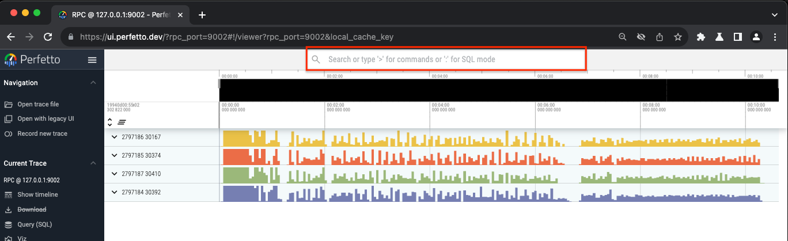
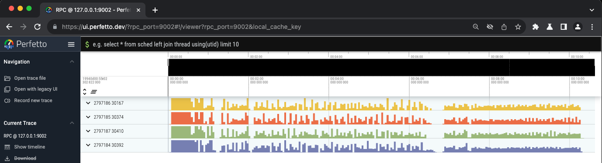
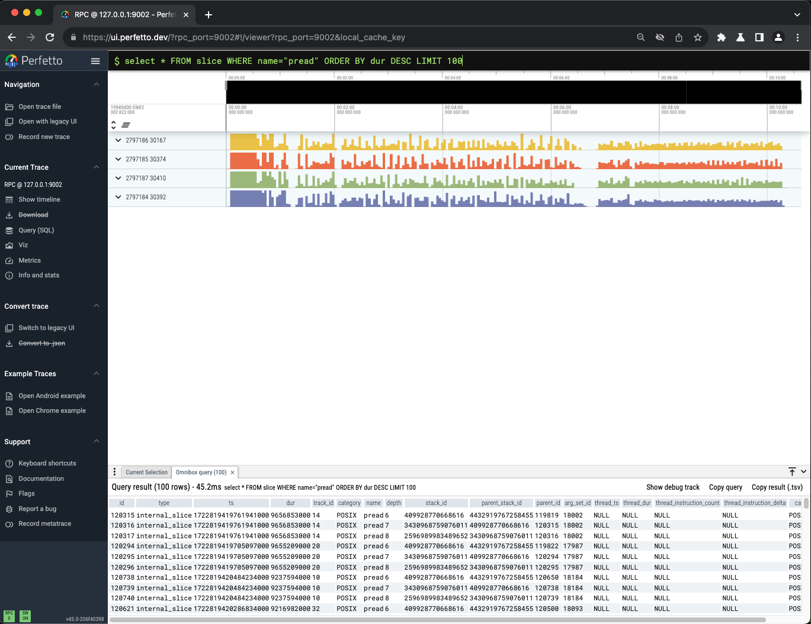

===========================
Perfetto UI
===========================

This section describes how to use `Perfetto UI <https://ui.perfetto.dev/>`_ to visualize :code:`dftracer` traces.

----------------------------------------
Loading traces
----------------------------------------

There are two ways to load traces into Perfetto UI:

#. Directly in the website

    .. warning::

        Use this if your traces are small

    * Go to `Perfetto UI <https://ui.perfetto.dev/>`_

        .. image:: images/perfetto/perfetto-interface.png
          :width: 800
          :alt: Perfetto UI Interface

    * On the top left corner, click **Open trace file** button and it will ask you to specify the location of the trace file

    * After loading, you can see your trace file now is visualized in Perfetto UI

        .. image:: images/perfetto/perfetto-viz.png
           :width: 800
           :alt: Perfetto Visualization

#. Using :code:`trace_processor`

    .. note::

        This is a recommeded way to load BIG traces into Perfetto UI.
        Using this your trace file will be loaded natively rather than in your browser.

    * Go to `Perfetto UI Trace Processor <https://perfetto.dev/docs/quickstart/trace-analysis>`_ and download the :code:`trace_processor`

    * After downloading, assuming that it is in the current directory, now you can bridge `Perfetto UI <https://ui.perfetto.dev/>`_ with :code:`trace_processor` by running the following command:

        .. code-block:: bash

            ./trace_processor --httpd --http-port <PORT> <trace file>

    * Then, in your browser, go to :code:`https://ui.perfetto.dev/?rpc_port=<PORT>`

        * If the :code:`Perfetto UI` ask for confirmation below, then click the button **Take me to the flags page**

            .. image:: images/perfetto/perfetto-flags-confirm-1.png
               :width: 800
               :alt: Perfetto Flags Confirmation

        * Now, changed this line from **disabled** to enabled** and reopen :code:`https://ui.perfetto.dev/?rpc_port=<PORT>`

            .. image:: images/perfetto/perfetto-flags-confirm-2.png
               :width: 800
               :alt: Perfetto Confirm CSP

    * :code:`Perfetto UI` will ask for confirmation to choose the UI. For this use case, we just need to choose **Use mismatched version regardless (might crash)**

        .. image:: images/perfetto/perfetto-ui-confirm.png
           :width: 800
           :alt: Perfetto UI Confirmation

    * Now, after done, you can see the same visualization as shown above in the first step

----------------------------------------
Using SQL Query
----------------------------------------

If you want to do simple trace analysis, fortunately, `Perfetto UI <https://ui.perfetto.dev/>`_ provides a SQL query interface.

To do this, click the textbox at the top as shown below

To start typing SQL query, you should type **:** and then the text box will change into darker color as shown below

Now, we can start typing SQL Query! For the list of tables that can be queried inside `Perfetto UI <https://ui.perfetto.dev/>`_, you can see it in `Perfetto Trace Processor Documentation <https://perfetto.dev/docs/analysis/trace-processor>`_.

Here are some examples that can help you to get started:

+++++++++++++++++++++++++++++++++++++++++++++++++
Query :code:`pread` ordered by duration
+++++++++++++++++++++++++++++++++++++++++++++++++

.. code-block:: sql

    select * FROM slice WHERE name="pread" ORDER BY dur DESC LIMIT 100

+++++++++++++++++++++++++++++++++++++++++++++++++
Query number of __getitem__
+++++++++++++++++++++++++++++++++++++++++++++++++

.. code-block:: sql

    select count(*) FROM slice WHERE name LIKE "%__getitem__%"

+++++++++++++++++++++++++++++++++++++++++++++++++
Find Thread ID of __getitem__
+++++++++++++++++++++++++++++++++++++++++++++++++

.. code-block:: sql

    SELECT DISTINCT thread.name as thread_name FROM slice JOIN thread_track ON thread_track.id = slice.track_id JOIN thread using (utid) WHERE slice.name LIKE "%__getitem__%"
